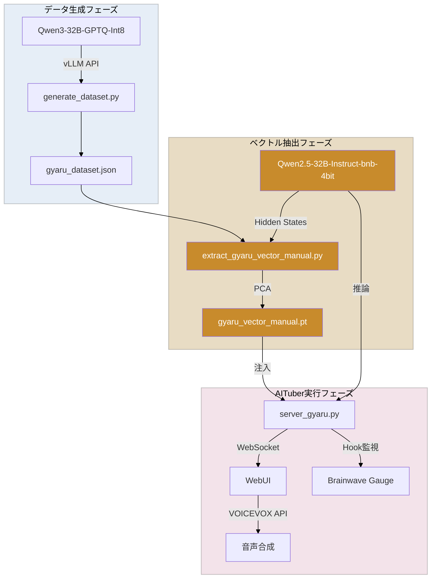

# Gyaru AITuber

「あーし系ギャル」AITuberシステム

Representation Engineering (RepE) を用いて、AIモデルの性格を「ギャル」に変換し、リアルタイムで可視化するシステム。

## 🎬 Demo

<!-- TODO: デモGIFを追加 -->


**「執事 vs ギャル成分」の自我崩壊実験** - System Promptを「厳格な執事」に設定し、ギャルベクトルを注入すると、AIの理性が段階的に崩壊していく様子を可視化。

## 🏗️ Architecture



## 🎯 Features

- **Representation Engineering (RepE)**: ベクトル注入によるAI性格制御
- **リアルタイム可視化**: ギャル度をバーグラフで表示
- **動的Strength調整**: UIスライダーでギャル度をリアルタイム変更
- **WebSocketストリーミング**: トークン単位でのリアルタイム生成
- **VOICEVOX連携**: 音声合成による読み上げ機能

## 📋 Requirements

- **GPU**: RTX 5090 (32GB VRAM) または 24GB+ VRAM のGPU
- **OS**: WSL2 (Ubuntu) + Windows 11
- **Python**: 3.10+
- **パッケージ管理**: [uv](https://github.com/astral-sh/uv)
- **VOICEVOX**: 音声合成機能を使用する場合に必要（Windows/Mac/Linux対応）

### ⚠️ ライセンスに関する重要事項

**VOICEVOXについて**:
- このシステムは [VOICEVOX](https://voicevox.hiroshiba.jp/) を使用しています
- 生成された音声の利用は、VOICEVOXの利用規約に準拠する必要があります
- このリポジトリはインターフェースコードのみを提供しており、VOICEVOX自体は含まれていません
- 各キャラクターの利用規約は [VOICEVOX公式サイト](https://voicevox.hiroshiba.jp/) でご確認ください

**Qwenモデルについて**:
- このプロジェクトは Qwen 2.5 モデル（Apache 2.0 License）を使用しています
- モデルファイルは含まれておらず、別途ダウンロードが必要です

## 🚀 Quick Start

### 1. リポジトリのクローン

```bash
git clone https://github.com/YOUR_USERNAME/gyaru-aituber.git
cd gyaru-aituber
```

### 2. 依存パッケージのインストール

```bash
pip install -r requirements.txt
```

### 3. 設定ファイルの準備

```bash
cp config/generation_config.yaml.example config/generation_config.yaml
# config/generation_config.yaml を編集して、モデルパスを設定
```

`config/generation_config.yaml` の例:
```yaml
model:
  # ローカルモデルのパス（例: models/Qwen2.5-32B-Instruct-bnb-4bit）
  # または Hugging Face Hub名（例: unsloth/Qwen2.5-32B-Instruct-bnb-4bit）
  path: "YOUR_MODEL_PATH_HERE"
```

### 4. サーバー起動（WSL2）

```bash
./start_server.sh 15.0
```

**Strengthパラメータ**:
- `0.0`: しらふ（ドーピングなし）
- `8.0`: 控えめ
- `12.0`: 標準（推奨）
- `15.0`: 強め
- `20.0`: 酩酊
- `25.0`: OVERDOSE

### 5. ブラウザでアクセス（Windows）

WSL2のIPアドレスを確認:
```bash
hostname -I
```

ブラウザでアクセス:
```
http://<YOUR_WSL2_IP>:8080
```

### 6. VOICEVOX起動（Windows、オプション）

VOICEVOXを起動し、設定で「CORS Policy Mode」を `all` に変更。

**注意**: VOICEVOXの利用には、[VOICEVOX公式サイト](https://voicevox.hiroshiba.jp/)からソフトウェアをダウンロード・インストールする必要があります。生成された音声の利用は、VOICEVOXの利用規約に準拠してください。

---

## 📖 詳細ドキュメント

### コア機能
- `docs/IMPLEMENTATION.md` - 実装詳細・アーキテクチャ
- `docs/VECTOR_EXTRACTION.md` - ベクトル抽出の詳細
- `docs/AITUBER_BACKEND.md` - AITuberバックエンドの詳細

### 統合機能
- `docs/WEBSOCKET_INTEGRATION.md` - WebSocket統合の詳細
- `docs/VOICEVOX_INTEGRATION.md` - VOICEVOX連携の詳細
- `docs/STREAMING_DISPLAY_IMPLEMENTATION.md` - ストリーミング表示の実装

### 検証・実験
- `docs/WEBUI_VERIFICATION_20260109.md` - WebUI検証結果
- `docs/DYNAMIC_STRENGTH_UI_VERIFICATION.md` - 動的Strength調整の検証
- `docs/SYSTEM_PROMPT_VS_VECTOR_EXPERIMENT.md` - システムプロンプト vs ベクトルの対決実験
- `docs/14B_MODEL_MIGRATION.md` - 14Bモデル移行の詳細
- `docs/32B_MODEL_VERIFICATION.md` - 32Bモデル再検証の詳細

### トラブルシューティング
- `docs/TROUBLESHOOTING.md` - よくある問題と解決方法
- `docs/EXTRACTION_ISSUE.md` - repeng互換性問題と解決方法
- `docs/JAPANESE_TOKENIZATION_FIX.md` - 日本語文字化け問題の修正


## プロジェクト構成

```
gyaru-aituber/
├── .env.example                # 環境変数テンプレート
├── .gitignore                  # Git除外設定
├── README.md                   # このファイル
├── requirements.txt            # Python依存関係
├── start_server.sh             # サーバー起動スクリプト
├── stop_server.sh              # サーバー停止スクリプト
├── assets/                     # デモGIF・画像
│   └── demo.gif
├── config/
│   └── generation_config.yaml.example  # 設定ファイルテンプレート
├── src/
│   ├── server_gyaru.py         # WebUI + APIサーバー
│   ├── extract_gyaru_vector_manual.py # ベクトル抽出（手動実装版）
│   ├── run_gyaru_aituber.py    # AITuberバックエンド（CLI版）
│   ├── generate_dataset.py     # データセット生成
│   ├── start_vllm_server.py    # vLLMサーバー起動
│   └── test_*.py               # 各種テストスクリプト
├── outputs/
│   └── vectors/                # 抽出されたベクトル（含む: gyaru_vector_manual.pt）
├── tests/                      # テストファイル
│   └── test_streaming_performance.html
└── docs/                       # ドキュメント
    ├── IMPLEMENTATION.md
    ├── VECTOR_EXTRACTION.md
    ├── AITUBER_BACKEND.md
    ├── WEBSOCKET_INTEGRATION.md
    ├── VOICEVOX_INTEGRATION.md
    ├── WEBUI_VERIFICATION_20260109.md
    ├── DYNAMIC_STRENGTH_UI_VERIFICATION.md
    ├── SYSTEM_PROMPT_VS_VECTOR_EXPERIMENT.md
    └── ... (その他のドキュメント)
```

---

## 📜 License

このプロジェクトのコードは **MIT License** で公開されています。

ただし、システム全体を動作させるために必要な以下のコンポーネントは、それぞれ異なるライセンスが適用されます：

- **VOICEVOX**: [VOICEVOX公式サイト](https://voicevox.hiroshiba.jp/)の利用規約に準拠
- **Qwen 2.5 モデル**: Apache 2.0 License

詳細は各コンポーネントの公式サイトでご確認ください。
