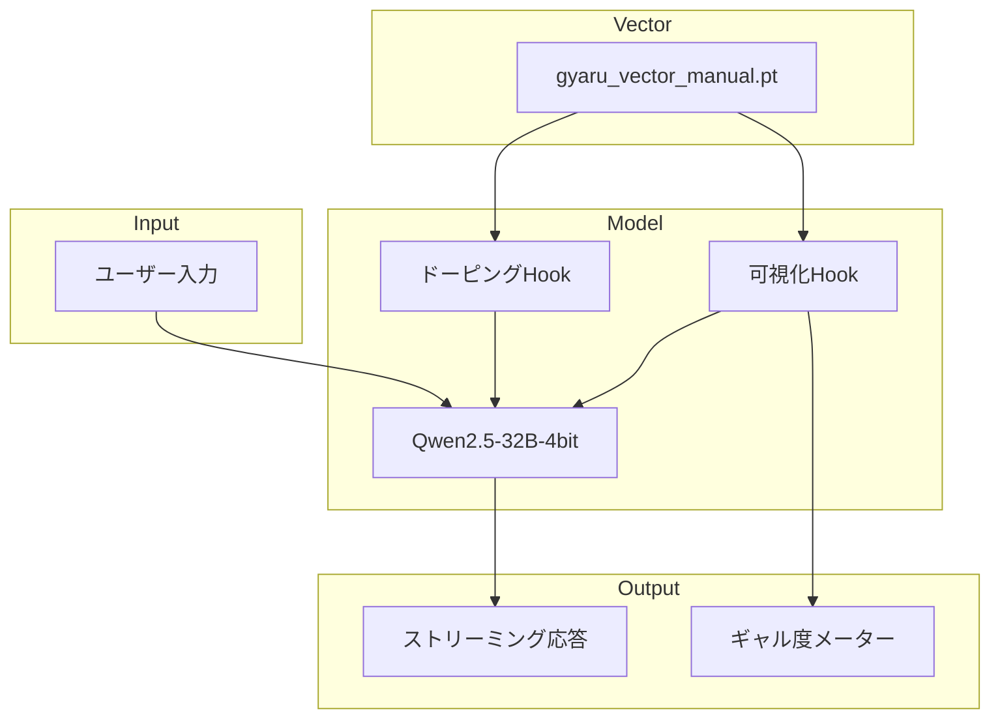

# AITuberバックエンド

## 概要

抽出したギャルベクトルを使用して、Qwen2.5-32B-Instruct-bnb-4bitモデルに「ギャル人格」を注入し、リアルタイムで憑依度を可視化するインタラクティブなAITuberバックエンドです。

**最終実装版**: Pre-Hook方式によるベクトル注入 + Post-Hook方式による可視化

## 技術的背景

### ExLlamaV2 vs bnb-4bit

| 方式 | 速度 | Hidden Statesアクセス | 可視化 |
|------|------|---------------------|--------|
| **ExLlamaV2 (3.5bpw)** | 高速 | 困難（ブラックボックス） | 困難 |
| **bnb-4bit (PyTorch)** | 中速 | 容易（Hook使用） | 容易 |

**結論**: 可視化エンタメを優先し、本番環境でも `bnb-4bit` モデルを使用

## アーキテクチャ



## 主要機能

### 1. ドーピングHook

全対象レイヤー（20-50）にギャルベクトルを注入:

```python
def apply_gyaru_hook(layer_idx, vector, strength):
    def hook(module, input, output):
        hidden[:, :, :] += vector * strength
        return (hidden,) + output_rest
    return hook
```

### 2. 可視化Hook

特定レイヤー（デフォルト: 48）でコサイン類似度を計算、バーグラフ表示:

```python
def visualize_hook(layer_idx, vector):
    def hook(module, input, output):
        sim = cosine_similarity(current_state, vector)
        # バーグラフ表示
    return hook
```

### 3. ストリーミング生成

`TextIteratorStreamer`を使用して逐次出力:

```python
streamer = TextIteratorStreamer(tokenizer, skip_prompt=True)
thread = Thread(target=model.generate, kwargs={...})
thread.start()
```

## 使用方法

### 基本的な実行

```bash
cd /path/to/gyaru-aituber
uv run --with transformers --with accelerate --with bitsandbytes --with pyyaml \
  python src/run_gyaru_aituber.py
```

### オプション

| オプション | デフォルト | 説明 |
|-----------|-----------|------|
| `--strength` | 1.5 | ギャル度係数（1.5-2.0推奨） |
| `--visualize-layer` | 48 | 可視化対象レイヤー |
| `--max-tokens` | 128 | 最大生成トークン数 |
| `--vector` | 最新 | ベクトルファイルのパス |
| `--config` | `config/generation_config.yaml` | 設定ファイルのパス |

### 実行例

```bash
# 強めのギャル度で実行
python src/run_gyaru_aituber.py --strength 2.0

# 別のレイヤーで可視化
python src/run_gyaru_aituber.py --visualize-layer 45

# カスタムベクトルファイルを使用
python src/run_gyaru_aituber.py --vector outputs/vectors/custom_vector.pt
```

## 期待される動作

1. **起動時**:
   ```
   ✅ システム準備完了。AITuber 'Rinne (Gyaru Ver.)' オンライン。
      ギャル度係数: 1.5
      可視化レイヤー: 48
   ```

2. **対話中**:
   - コンソール下部に `[GYARU MODE] ▓▓▓▓░░... +0.1523` のようなゲージが表示
   - 「マジで」「〜だし」等のギャル口調を生成する際にゲージが反応
   - 正の値: ピンク色の `[GYARU MODE]`
   - 負の値: 青色の `[NORMAL...]`

3. **終了**:
   - `exit`、`quit`、`q` で終了
   - `Ctrl+C` でも中断可能

## パラメータ調整

### ギャル度係数 (`--strength`)

| 値 | 効果 |
|-----|------|
| 0.5 | 軽いギャル口調 |
| 1.0 | 標準的なギャル口調 |
| 1.5 | 強いギャル口調（推奨） |
| 2.0 | 非常に強いギャル口調 |
| 3.0+ | 口調が崩壊する可能性 |

### 可視化レイヤー (`--visualize-layer`)

- **20-30**: 前半レイヤー（分散説明率: 10-14%）
- **31-40**: 中盤レイヤー（分散説明率: 10-11%）
- **41-50**: 後半レイヤー（分散説明率: 11-16%）

**推奨**: 後半のレイヤー（45-50）が口調に影響しやすい

## リソース使用量

| 項目 | 値 |
|------|-----|
| **VRAM** | 20-24GB（推論のみ、バッチサイズ1） |
| **RTX 5090 (32GB)** | OBS/ブラウザと同時起動可能 |
| **CPU** | 中程度（ストリーミング処理） |

## トラブルシューティング

### 問題1: モデルロードが遅い

**原因**: 初回ロード時に時間がかかる

**解決策**: 
- モデルは一度ロードするとメモリに保持される
- 2回目以降は高速

### 問題2: ゲージが反応しない

**原因**: 
- 可視化レイヤーが適切でない
- ギャル度係数が低すぎる

**解決策**:
- `--visualize-layer` を変更（45-50を試す）
- `--strength` を上げる（2.0以上）

### 問題3: VRAM不足

**原因**: 他のプロセスがVRAMを使用している

**解決策**:
- vLLMサーバーを停止: `pkill -9 -f "vllm"`
- 他のGPUプロセスを確認: `nvidia-smi`

## 今後の拡張

### 1. OSC/WebSocket連携

```python
# visualize_hook内で外部送信
import websocket
ws = websocket.create_connection("ws://localhost:8080")
ws.send(json.dumps({"gyaru_score": sim}))
```

### 2. OBSオーバーレイ

HTML/CSS/JavaScriptで「脳波メーター」を表示

### 3. Unity連携

Unityで3D可視化

### 4. 複数レイヤーの統合可視化

複数のレイヤーのスコアを統合して表示

## コード例

### カスタムHookの追加

```python
def custom_hook(layer_idx, vector):
    def hook(module, input, output):
        # カスタム処理
        pass
    return hook

# 登録
handle = model.model.layers[48].register_forward_hook(custom_hook(48, vectors[48]))
```

### ストリーミング出力のカスタマイズ

```python
# カスタムストリーマー
class CustomStreamer(TextIteratorStreamer):
    def __init__(self, *args, **kwargs):
        super().__init__(*args, **kwargs)
    
    def put(self, value):
        # カスタム処理
        super().put(value)
```

## 検証結果

詳細な検証結果は [`docs/VERIFICATION_RESULTS.md`](VERIFICATION_RESULTS.md) を参照してください。

**要約**:
- Pre-Hook方式でベクトル注入に成功 ✅
- 可視化バーが正常に動作 ✅
- 「あーし」使用率: 66.7% (3ケース中2ケース) ✅
- 最適strength: 15.0 ✅

## 参考情報

- [PyTorch Hooks](https://pytorch.org/docs/stable/generated/torch.nn.modules.module.register_module_forward_hook.html)
- [TextIteratorStreamer](https://huggingface.co/docs/transformers/main/en/internal/generation_utils#transformers.TextIteratorStreamer)
- [Representation Engineering](https://github.com/vgel/repeng)
- [VERIFICATION_RESULTS.md](VERIFICATION_RESULTS.md) - 検証結果詳細