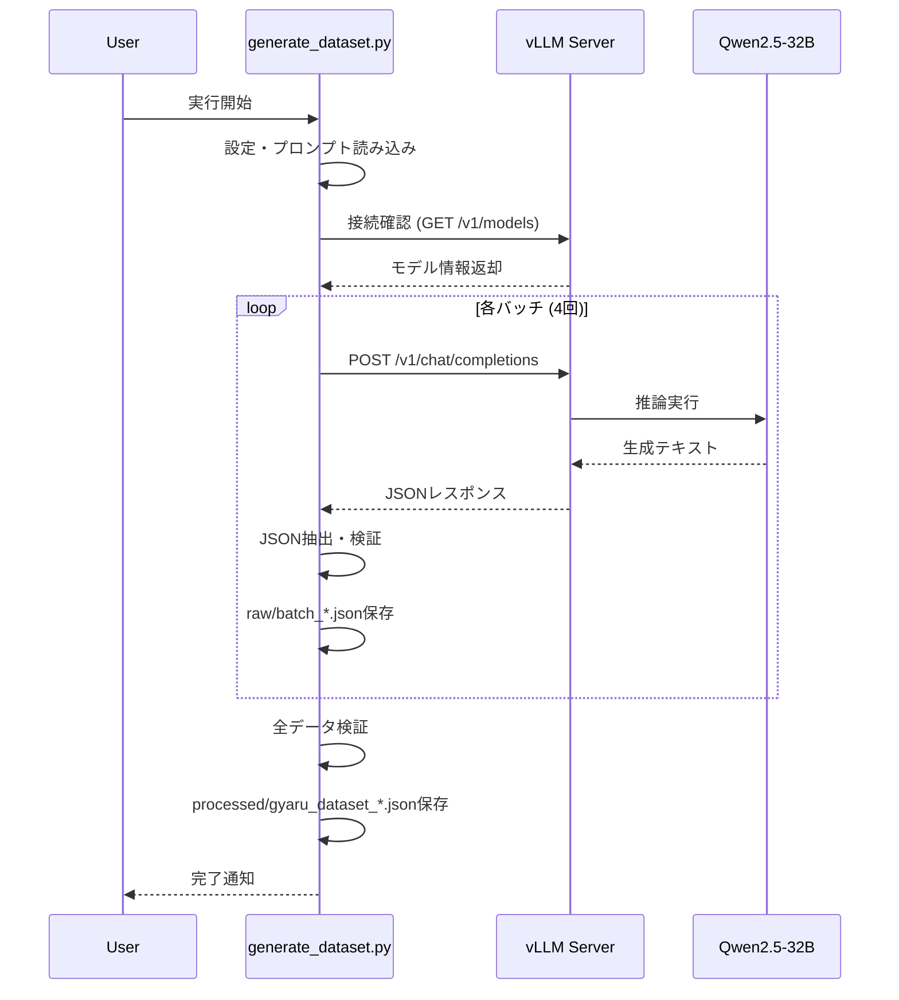

# 実装詳細

## アーキテクチャ

```mermaid
graph TB
    subgraph "データ生成フロー"
        A[プロンプト読み込み] --> B[vLLMサーバー起動]
        B --> C[OpenAI APIクライアント]
        C --> D[バッチ生成]
        D --> E[JSON抽出・検証]
        E --> F[データセット保存]
    end
    
    subgraph "vLLMサーバー"
        B --> G[モデルロード]
        G --> H[OpenAI互換API]
        H --> I[/v1/chat/completions]
    end
    
    subgraph "設定管理"
        J[generation_config.yaml] --> B
        J --> D
    end
    
    subgraph "出力"
        F --> K[raw/batch_*.json]
        F --> L[processed/gyaru_dataset_*.json]
    end
```

## 技術スタック

### コア技術

- **推論エンジン**: vLLM 0.13.0
  - GPTQ/4bit量子化サポート
  - OpenAI互換API
  - 高速推論（PagedAttention）

- **モデル**: Qwen2.5-32B-Instruct-bnb-4bit
  - 4bit量子化（BitsAndBytes）
  - VRAM使用量: 約16GB
  - フォールバックモデル（本来は `Qwen3-32B-GPTQ-Int8` を使用予定）

- **パッケージ管理**: uv
  - 高速なPythonパッケージマネージャー
  - `--with` オプションで動的依存追加

- **APIクライアント**: OpenAI Python Client 1.0.0+
  - vLLMのOpenAI互換APIと互換

### 依存パッケージ

```python
vllm>=0.6.0
openai>=1.0.0
pydantic>=2.0.0
pydantic-settings>=2.0.0
pyyaml>=6.0
rich>=13.0.0
tqdm>=4.65.0
jsonschema>=4.17.0
pandas>=2.0.0
bitsandbytes>=0.46.1  # 4bit量子化用（動的追加）
```

## ファイル構成

```
gyaru-aituber/
├── config/
│   └── generation_config.yaml    # 設定ファイル
├── src/
│   ├── start_vllm_server.py      # vLLMサーバー起動
│   └── generate_dataset.py       # データ生成メインスクリプト
├── prompts/
│   └── system_prompt.txt         # システムプロンプト
├── outputs/
│   ├── raw/                      # バッチごとの生データ
│   └── processed/                # 検証済み最終データ
└── docs/                         # ドキュメント
```

## 主要コンポーネント

### 1. vLLMサーバー (`src/start_vllm_server.py`)

**役割**: vLLMのOpenAI互換APIサーバーを起動

**主要機能**:
- 設定ファイル（YAML）からパラメータ読み込み
- `uv run` でvLLMを実行（環境分離）
- 量子化方式（GPTQ/bitsandbytes）の自動選択
- dtype指定（GPTQはfloat16のみ）

**起動コマンド例**:
```bash
uv run --with vllm --with bitsandbytes python -m vllm.entrypoints.openai.api_server \
  --model models/Qwen2.5-32B-Instruct-bnb-4bit \
  --host localhost \
  --port 8000 \
  --quantization bitsandbytes \
  --dtype float16 \
  --gpu-memory-utilization 0.8 \
  --max-model-len 8192
```

### 2. データ生成器 (`src/generate_dataset.py`)

**役割**: vLLM APIを使ってデータセットを生成

**主要クラス**:
- `DatasetConfig`: 設定管理（Pydantic）
- `GyaruDatasetGenerator`: データ生成ロジック

**処理フロー**:
1. 設定ファイル読み込み
2. プロンプト読み込み
3. vLLMサーバー接続確認
4. バッチごとに生成:
   - OpenAI APIでリクエスト送信
   - JSON抽出（```json``` ブロック対応）
   - ID・バッチ番号・タイムスタンプ付与
5. 品質検証（「あーし」含有チェック）
6. 保存（raw + processed）

**生成パラメータ**:
- Temperature: 0.8
- Top-p: 0.9
- Max tokens: 2000
- バッチ数: 4バッチ × 30ペア = 120ペア

### 3. 設定ファイル (`config/generation_config.yaml`)

**構造**:
```yaml
model:
  path: "models/Qwen2.5-32B-Instruct-bnb-4bit"
  quantization: "bitsandbytes"

vllm:
  host: "localhost"
  port: 8000
  quantization: "bitsandbytes"
  tensor_parallel_size: 1
  gpu_memory_utilization: 0.80
  max_model_len: 8192
  trust_remote_code: true

generation:
  num_pairs_per_batch: 30
  total_batches: 4
  temperature: 0.8
  top_p: 0.9
  max_new_tokens: 2000

output:
  output_dir: "outputs"
  raw_dir: "outputs/raw"
  processed_dir: "outputs/processed"

validation:
  require_ash: true
```

### 4. プロンプト (`prompts/system_prompt.txt`)

**構成**:
- Role定義: シナリオライター兼AITuberプロデューサー
- Goal: Standard/Gyaruペア生成
- Definition: 「あーし系ギャル」の定義
- Topic List: Tech, Streaming, Daily, Gaming
- Output Format: JSON形式、8個の例
- Order: 30ペア生成指示

**特徴**:
- Few-shot learning（8個の例）
- 「あーし」使用を強調
- トピックバランスを考慮

## データフロー



## 設定パラメータ詳細

### vLLM設定

| パラメータ | 値 | 説明 |
|-----------|-----|------|
| `host` | `localhost` | APIサーバーのホスト |
| `port` | `8000` | APIサーバーのポート |
| `quantization` | `bitsandbytes` | 量子化方式（GPTQ/bitsandbytes） |
| `tensor_parallel_size` | `1` | テンソル並列化（マルチGPU時は増やす） |
| `gpu_memory_utilization` | `0.80` | GPUメモリ使用率（0.0-1.0） |
| `max_model_len` | `8192` | 最大シーケンス長（KVキャッシュサイズに影響） |
| `trust_remote_code` | `true` | リモートコード実行許可（Qwen3で必要） |
| `dtype` | `float16` | データ型（GPTQはfloat16のみ） |

### 生成パラメータ

| パラメータ | 値 | 説明 |
|-----------|-----|------|
| `num_pairs_per_batch` | `30` | 1バッチあたりのペア数 |
| `total_batches` | `4` | 総バッチ数 |
| `temperature` | `0.8` | サンプリング温度（高いほど多様） |
| `top_p` | `0.9` | Nucleus sampling |
| `max_new_tokens` | `2000` | 最大生成トークン数 |

## バージョン情報

- **プロジェクトバージョン**: 1.0.0
- **vLLM**: 0.13.0
- **Python**: 3.10+
- **CUDA**: 12.9
- **GPU**: NVIDIA GeForce RTX 5090 (32GB VRAM)
- **OS**: WSL2 (Ubuntu)

## パフォーマンス

- **モデルロード時間**: 約3-5分（初回）
- **1バッチ生成時間**: 約35-40秒
- **総生成時間**: 約2分44秒（4バッチ）
- **VRAM使用量**: 30,242 MiB / 32,607 MiB (約93%)
- **GPU使用率**: アイドル時9%、生成時80-90%

## 今後の拡張予定

1. **マルチGPU対応**: `tensor_parallel_size` を増やして複数GPUで実行
2. **プロンプト最適化**: 「あーし」含有率100%を目指す
3. **品質スコアリング**: より詳細な品質指標の導入
4. **バッチ並列化**: 複数バッチを並列生成
5. **設定の動的読み込み**: モデルパスを設定ファイルから読み込み
